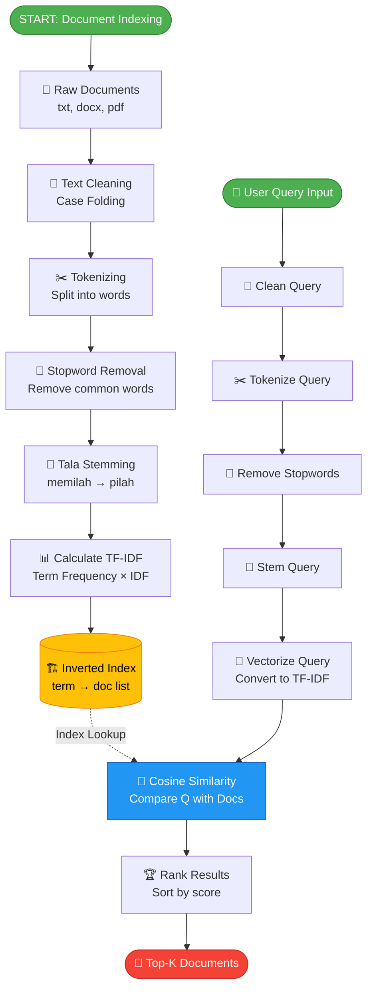

# Information Retrieval System - Flowchart

## Alur Sistem IR dengan VSM

## Penjelasan Alur Lengkap

### 📌 PHASE 1: Document Indexing (Offline - Saat Program Start)

1. **Raw Documents** → Sistem membaca semua file dari `data/raw/`
2. **Text Cleaning** → Lowercase, hapus karakter spesial
3. **Tokenizing** → Pecah kalimat jadi kata: `"Data mining"` → `["data", "mining"]`
4. **Stopword Removal** → Buang kata umum: `["di", "ke", "yang"]`
5. **Tala Stemming** → Kata dasar: `"memilah"` → `"pilah"`
6. **Calculate TF-IDF** → Hitung bobot setiap term di setiap dokumen
7. **Build Inverted Index** → Simpan struktur: `{"pilah": [doc1, doc3], "data": [doc1, doc2]}`

### 📌 PHASE 2: Query Processing (Online - Saat User Search)

1. **User Query** → User ketik: `"memilah data"`
2. **Clean → Tokenize → Stopword → Stem** → **WAJIB sama dengan dokumen!**
   - Query jadi: `["pilah", "data"]`
3. **Vectorize Query** → Ubah jadi vektor TF-IDF
4. **Cosine Similarity** → Bandingkan query dengan semua dokumen di index
5. **Rank Results** → Urutkan dari skor tertinggi
6. **Return Top-K** → Tampilkan dokumen paling relevan

## 🔑 Poin Penting

- **Preprocessing HARUS SAMA** antara dokumen dan query
- **Tala Stemming** memastikan "memilah", "dipilah", "pemilah" semua jadi "pilah"
- **Inverted Index** membuat pencarian sangat cepat (O(1) lookup)
- **Cosine Similarity** mengukur kemiripan arah vektor (0-1)

## Cara Lihat Diagram

1. **VS Code**: Install extension "Markdown Preview Mermaid Support"
2. **Online**: Copy kode mermaid ke https://mermaid.live
3. **Draw.io**: Arrange → Insert → Advanced → Mermaid
