# Information Retrieval System - Flowchart

## Alur Sistem IR dengan VSM

```mermaid
flowchart TB
    %% PHASE 1: DOCUMENT INDEXING
    Start([START: Document Indexing])
    Docs[📂 Raw Documents<br/>txt, docx, pdf]
    
    %% Preprocessing
    Clean[🧹 Text Cleaning<br/>Case Folding]
    Token[✂️ Tokenizing<br/>Split into words]
    Stop[🚫 Stopword Removal<br/>Remove common words]
    Stem[🌱 Tala Stemming<br/>memilah → pilah]
    
    %% VSM Indexing
    CalcTF[📊 Calculate TF-IDF<br/>Term Frequency × IDF]
    BuildIndex[(🏗️ Inverted Index<br/>term → doc list)]
    
    %% PHASE 2: QUERY PROCESSING
    Query([👤 User Query Input])
    QClean[🧹 Clean Query]
    QToken[✂️ Tokenize Query]
    QStop[🚫 Remove Stopwords]
    QStem[🌱 Stem Query]
    QVector[📐 Vectorize Query<br/>Convert to TF-IDF]
    
    %% Matching
    CosSim[🧮 Cosine Similarity<br/>Compare Q with Docs]
    Rank[🏆 Rank Results<br/>Sort by score]
    Result([📄 Top-K Documents])
    
    %% Flow connections - INDEXING
    Start --> Docs
    Docs --> Clean
    Clean --> Token
    Token --> Stop
    Stop --> Stem
    Stem --> CalcTF
    CalcTF --> BuildIndex
    
    %% Flow connections - SEARCH
    Query --> QClean
    QClean --> QToken
    QToken --> QStop
    QStop --> QStem
    QStem --> QVector
    
    BuildIndex -.Index Lookup.-> CosSim
    QVector --> CosSim
    CosSim --> Rank
    Rank --> Result
    
    %% Styling
    style Start fill:#4CAF50,stroke:#2E7D32,color:#fff
    style Query fill:#4CAF50,stroke:#2E7D32,color:#fff
    style Result fill:#F44336,stroke:#C62828,color:#fff
    style BuildIndex fill:#FFC107,stroke:#F57C00,color:#000
    style CosSim fill:#2196F3,stroke:#1565C0,color:#fff
```

## Penjelasan Alur Lengkap

### 📌 PHASE 1: Document Indexing (Offline - Saat Program Start)

1. **Raw Documents** → Sistem membaca semua file dari `data/raw/`
2. **Text Cleaning** → Lowercase, hapus karakter spesial
3. **Tokenizing** → Pecah kalimat jadi kata: `"Data mining"` → `["data", "mining"]`
4. **Stopword Removal** → Buang kata umum: `["di", "ke", "yang"]`
5. **Tala Stemming** → Kata dasar: `"memilah"` → `"pilah"`
6. **Calculate TF-IDF** → Hitung bobot setiap term di setiap dokumen
7. **Build Inverted Index** → Simpan struktur: `{"pilah": [doc1, doc3], "data": [doc1, doc2]}`

### 📌 PHASE 2: Query Processing (Online - Saat User Search)

1. **User Query** → User ketik: `"memilah data"`
2. **Clean → Tokenize → Stopword → Stem** → **WAJIB sama dengan dokumen!**
   - Query jadi: `["pilah", "data"]`
3. **Vectorize Query** → Ubah jadi vektor TF-IDF
4. **Cosine Similarity** → Bandingkan query dengan semua dokumen di index
5. **Rank Results** → Urutkan dari skor tertinggi
6. **Return Top-K** → Tampilkan dokumen paling relevan

## 🔑 Poin Penting

- **Preprocessing HARUS SAMA** antara dokumen dan query
- **Tala Stemming** memastikan "memilah", "dipilah", "pemilah" semua jadi "pilah"
- **Inverted Index** membuat pencarian sangat cepat (O(1) lookup)
- **Cosine Similarity** mengukur kemiripan arah vektor (0-1)

## Cara Lihat Diagram

1. **VS Code**: Install extension "Markdown Preview Mermaid Support"
2. **Online**: Copy kode mermaid ke https://mermaid.live
3. **Draw.io**: Arrange → Insert → Advanced → Mermaid
